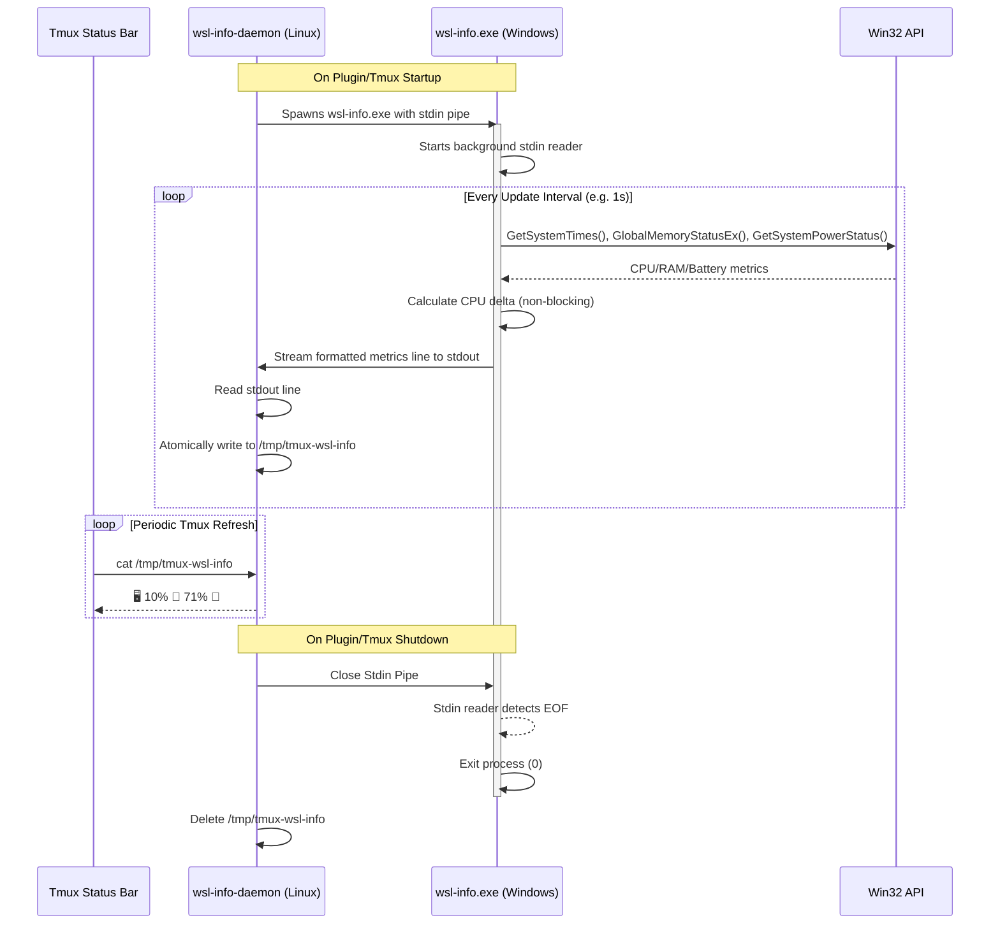

# tmux-wsl-info

Display Windows host system information (CPU, RAM, battery) in your tmux status bar — designed for WSL2.

All data is fetched from the Windows host via a single persistent Win32 API query helper and cached in `/tmp` to keep your status bar responsive and eliminate process spawning overhead.

---

## How It Works

Unlike other plugins that repeatedly spawn shell commands or Windows executables (which is extremely heavy and slow under WSL interop), `tmux-wsl-info` uses a **persistent-process architecture**:

1. **Daemon Startup**: On tmux load, the Linux daemon `wsl-info-daemon` spawns the Windows executable `wsl-info.exe` **once** as a background subprocess, establishing standard input and output pipes.
2. **Streaming Metrics**: `wsl-info.exe` loops internally, calling native Win32 APIs (`GetSystemTimes`, `GlobalMemoryStatusEx`, `GetSystemPowerStatus`) and streams formatted update lines to the daemon over its stdout pipe.
3. **Cache File**: The daemon reads the stream line-by-line and atomically writes it to `/tmp/tmux-wsl-info`.
4. **Tmux Rendering**: Tmux displays the contents of `/tmp/tmux-wsl-info` in the status bar.
5. **Clean Exit**: When tmux exits or restarts, the daemon closes the stdin pipe to `wsl-info.exe`. The helper detects the closed pipe (EOF) and immediately terminates, preventing orphaned processes.



---

## Installation

### With [TPM](https://github.com/tmux-plugins/tpm) (recommended)

Add to your `.tmux.conf`:

```shell
set -g @plugin 'erancihan/tmux-wsl-info'
```

Then press `prefix + I` to install.

### Manual

Clone the repo:

```shell
git clone https://github.com/erancihan/tmux-wsl-info ~/.config/tmux/plugins/tmux-wsl-info
```

Add to the bottom of `.tmux.conf`:

```shell
run '~/.config/tmux/plugins/tmux-wsl-info/wsl-info.tmux'
```

Reload tmux:

```shell
tmux source-file ~/.tmux.conf
```

---

## Usage

Add the format string below to your `status-right` or `status-left`:

| Format String  | Description                           | Example Output                   |
| -------------- | ------------------------------------- | -------------------------------- |
| `#{wsl_info}`  | Host CPU, RAM, & Battery info (Padded) | `🖥️   9% 🧠  72% 🔌`               |

### Example

```shell
set -g status-right '#{wsl_info}'
```

---

## Customization

All options are configured via tmux `@` options in `.tmux.conf`.

| Option            | Default | Description                                                   |
| ----------------- | ------- | ------------------------------------------------------------- |
| `@wsl_cache_ttl`  | `1`     | Refresh interval in seconds (daemon update & sampling frequency) |

### Example Configuration

```shell
# Refresh metrics every 5 seconds
set -g @wsl_cache_ttl "5"
```

---

## License

[MIT](LICENSE)
